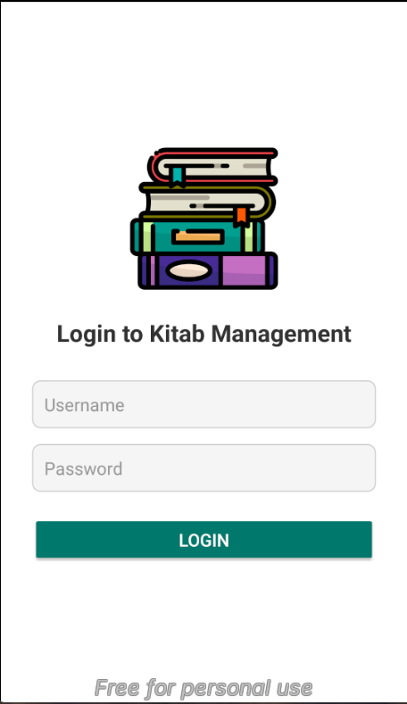
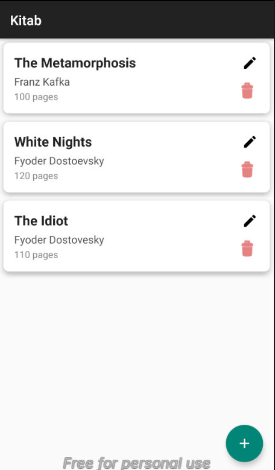
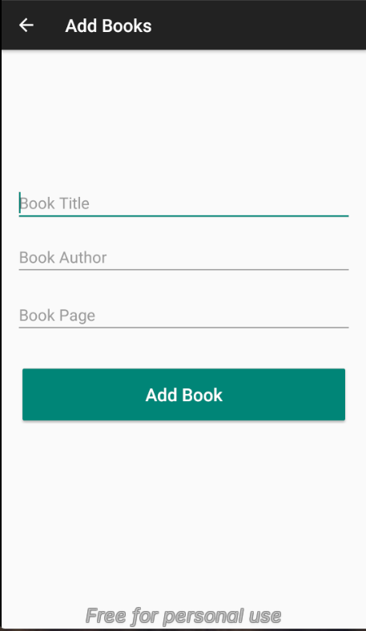
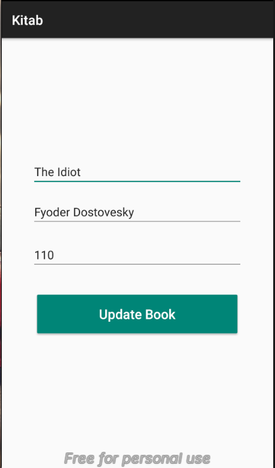
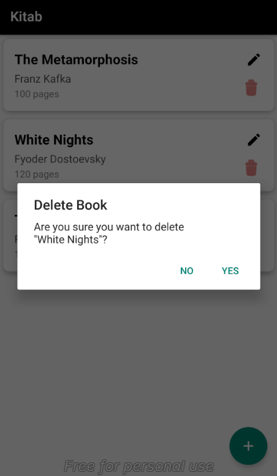
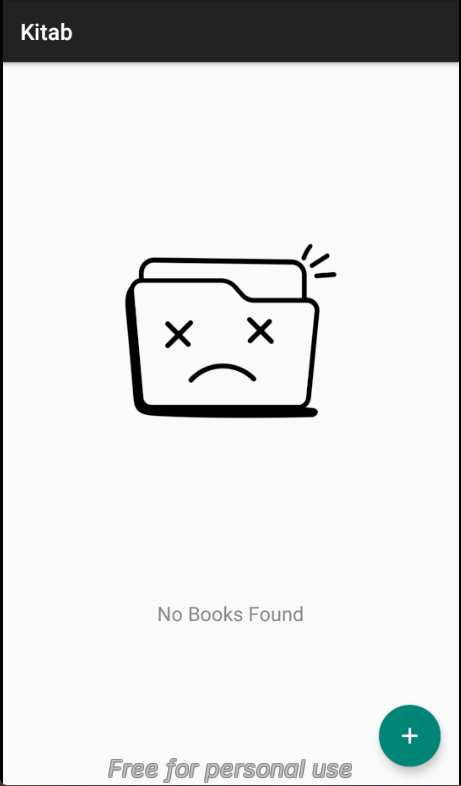

# 📚 E-Book

A basic Book Library Android application built with **Android Studio** and **SQLite Database**.

<hr/>

## 📸 Screenshots


<table>
  <tr>
    <td><strong>Login Page</strong><br></td>
    <td><strong>Book List</strong><br></td>
    <td><strong>Add Book</strong><br></td>
  </tr>
</table>
<hr/>
<table>
  <tr>
    <td><strong>Update Book</strong><br></td>
    <td><strong>Confirm Delete</strong><br></td>
    <td><strong>No Books Found</strong><br></td>
  </tr>
  <tr>
    <td></td>
    <td></td>
    <td></td>
  </tr>
</table>

<hr/>


## ✨ Features

- 📖 View a list of books  
- ➕ Add new books  
- ✏️ Edit existing book details  
- ❌ Delete books  
- 🔍 Clean and simple UI

## 🛠 Tech Stack

- **Language:** Java  
- **IDE:** Android Studio  
- **Database:** SQLite (or Firebase if extended)

## 🚀 Getting Started

1. Clone the repository:
   ```bash
   git clone https://github.com/sooocil/ebook.git


Open the project in Android Studio.

Run the app on an emulator or physical device.


